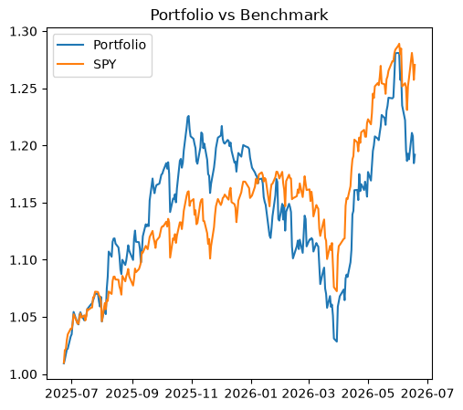
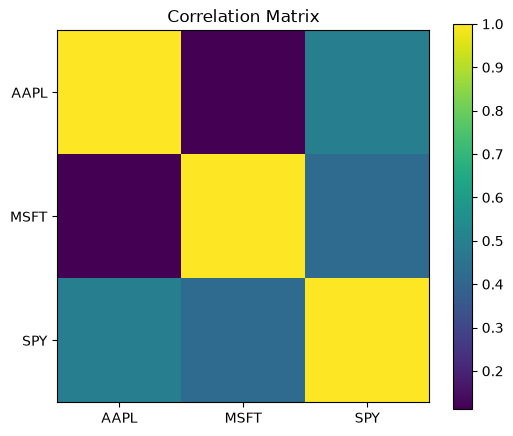
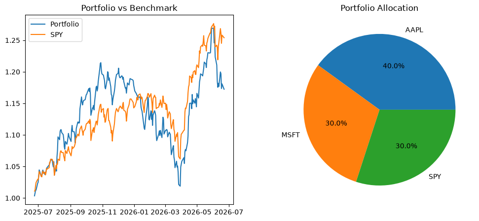

# Portfolio Analytics Toolkit

An open-source Python project for portfolio performance analysis, risk measurement, benchmark comparison, and investment analytics.

This project was built to develop practical skills in quantitative finance, portfolio management, Python development, automated testing, Git/GitHub workflows, and open-source software engineering.


---

## Overview

Portfolio Analytics Toolkit downloads historical market data from Yahoo Finance and calculates key portfolio performance and risk metrics. The project includes benchmark comparison capabilities, performance visualizations, automated testing, and CI/CD workflows.

The goal is to combine practical portfolio management concepts with professional software engineering practices.

---

## Features

### Portfolio Analytics

* Daily Returns
* Portfolio Return Aggregation
* Compound Annual Growth Rate (CAGR)
* Sharpe Ratio
* Annualized Volatility
* Maximum Drawdown
* Correlation Matrix
* Benchmark Comparison
* Portfolio Beta
* Portfolio Alpha

### Visualizations

* Portfolio Growth Chart
* Portfolio vs Benchmark Chart
* Asset Allocation Pie Chart
* Correlation Heatmap

### Software Engineering

* Unit Testing with pytest
* Continuous Integration with GitHub Actions
* Feature Branch Workflow
* Pull Request Workflow
* Version Control with Git
* Project Documentation
* Release Tagging

---

## Screenshots

### Portfolio vs Benchmark



### Correlation Heatmap



### Asset Allocation



---

## Technologies

### Finance & Analytics

* Python
* pandas
* NumPy
* matplotlib
* yfinance

### Development Tools

* pytest
* Git
* GitHub
* GitHub Actions

---

## Installation

Clone the repository:

```bash
git clone https://github.com/paeezan61-pixel/portfolio-analytics-toolkit-2.git
cd portfolio-analytics-toolkit-2
```

Install dependencies:

```bash
pip install -r requirements.txt
```

---

## Usage

Run the application:

```bash
python src/main.py
```

Example configuration:

```python
tickers = ["AAPL", "MSFT", "SPY"]

weights = [0.4, 0.3, 0.3]

benchmark = "SPY"
```

---

## Example Output

```text
Portfolio Sharpe Ratio:
1.24

Annualized Volatility:
15.16%

Maximum Drawdown:
-16.11%

Portfolio CAGR:
19.36%

Benchmark CAGR:
14.82%

Portfolio Beta:
1.05

Portfolio Alpha:
3.20%
```

---

## Project Structure

```text
PortfolioAnalyticsToolkit
│
├── src
│   ├── data_loader.py
│   ├── metrics.py
│   ├── portfolio.py
│   └── main.py
│
├── tests
│   ├── test_metrics.py
│   └── test_portfolio.py
│
├── docs
│   ├── documentation.md
│   └── images
│       ├── allocation-chart.png
│       ├── correlation-heatmap.png
│       ├── portfolio-vs-benchmark.png
│       └── github-actions.png
│
├── .github
│   └── workflows
│       └── python-tests.yml
│
├── README.md
├── CHANGELOG.md
├── ROADMAP.md
├── LICENSE
└── requirements.txt
```

---

## Testing

Run the full test suite:

```bash
python -m pytest -v
```

Expected output:

```text
7 passed
```

---

## Continuous Integration

GitHub Actions automatically runs the test suite on:

* Every push
* Every pull request

This helps maintain code quality and ensures that new changes do not break existing functionality.

---

## Development Workflow

This repository follows a professional feature-branch workflow:

### Create a Feature Branch

```bash
git checkout -b feature/new-feature
```

### Commit Changes

```bash
git add .
git commit -m "Add new feature"
```

### Push Branch

```bash
git push origin feature/new-feature
```

### Open Pull Request

* Create Pull Request on GitHub
* Review changes
* Merge into `main`
* GitHub Actions validates the build

---

## Current Analytics

| Metric               | Status |
| -------------------- | ------ |
| Daily Returns        | ✅      |
| Portfolio Returns    | ✅      |
| CAGR                 | ✅      |
| Sharpe Ratio         | ✅      |
| Volatility           | ✅      |
| Maximum Drawdown     | ✅      |
| Correlation Matrix   | ✅      |
| Benchmark Comparison | ✅      |
| Beta                 | ✅      |
| Alpha                | ✅      |

---

## Roadmap

### Performance Attribution

* Information Ratio
* Tracking Error

### Portfolio Construction

* Portfolio Optimization
* Efficient Frontier
* Maximum Sharpe Portfolio
* Minimum Volatility Portfolio

### Testing

* Expanded Test Coverage
* Edge Case Validation
* Integration Tests

### Visualization

* Drawdown Charts
* Efficient Frontier Charts
* Enhanced Reporting Dashboard

---

## Learning Objectives

This repository is part of an ongoing effort to develop practical expertise in:

* Portfolio Management
* Investment Analysis
* Quantitative Finance
* Risk Analytics
* Python Development
* Software Engineering
* Git and GitHub
* Open Source Development

---

## License

This project is licensed under the MIT License.

See the LICENSE file for additional details.
