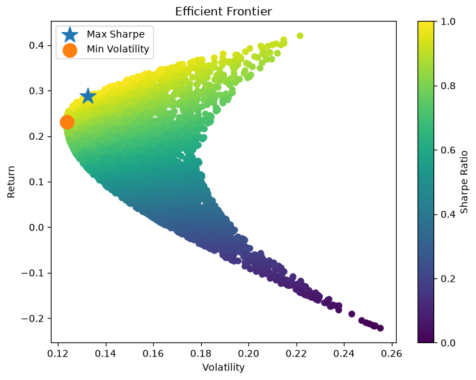

# Portfolio Analytics and Optimization Toolkit

An open-source Python project for portfolio analytics, risk measurement, performance attribution, and portfolio optimization.

This project was built to develop practical skills in quantitative finance, portfolio management, Python development, Git/GitHub workflows, automated testing, continuous integration, and open-source software engineering.

---

## Features

### Portfolio Analytics

* Daily Return Calculation
* Portfolio Return Aggregation
* Portfolio Growth Tracking
* Compound Annual Growth Rate (CAGR)
* Sharpe Ratio
* Annualized Volatility
* Maximum Drawdown
* Correlation Matrix

### Benchmark Analytics

* Benchmark Comparison
* Beta
* Alpha
* Tracking Error
* Information Ratio

### Portfolio Optimization

* Portfolio Performance Estimation
* Random Portfolio Simulation
* Efficient Frontier Generation
* Maximum Sharpe Portfolio
* Minimum Volatility Portfolio

### Visualizations

* Portfolio vs Benchmark Chart
* Asset Allocation Pie Chart
* Correlation Heatmap
* Efficient Frontier Visualization

### Software Engineering

* Unit Testing with pytest
* Continuous Integration with GitHub Actions
* Feature Branch Workflow
* Pull Request Workflow
* Version Control with Git

---

## Screenshots

### Portfolio vs Benchmark


### Asset Allocation


### Correlation Heatmap


### Efficient Frontier



---

## Technologies

* Python
* Pandas
* NumPy
* Matplotlib
* yfinance
* pytest
* Git
* GitHub
* GitHub Actions

---

## Installation

Clone the repository:

```bash
git clone https://github.com/paeezan61-pixel/portfolio-analytics-toolkit-2.git
cd portfolio-analytics-toolkit-2
```

Install dependencies:

```bash
pip install -r requirements.txt
```

---

## Usage

Run the application:

```bash
python src/main.py
```

Example portfolio:

```python
tickers = ["AAPL", "MSFT", "SPY"]

weights = [0.4, 0.3, 0.3]
```

Example output:

```text
Portfolio Sharpe Ratio: 1.13
Annualized Volatility: 15.16%
Maximum Drawdown: -16.11%
Portfolio CAGR: 17.39%

Portfolio Beta: 0.92
Portfolio Alpha: -6.38%

Tracking Error: 9.96%
Information Ratio: -0.65

Maximum Sharpe Portfolio
Return: 28.81%
Volatility: 13.24%
Sharpe Ratio: 2.18

Minimum Volatility Portfolio
Return: 23.15%
Volatility: 12.37%
Sharpe Ratio: 1.87
```

---

## Project Structure

```text
PortfolioAnalyticsToolkit
│
├── src
│   ├── data_loader.py
│   ├── metrics.py
│   ├── portfolio.py
│   ├── optimization.py
│   └── main.py
│
├── tests
│   ├── test_metrics.py
│   ├── test_portfolio.py
│   └── test_optimization.py
│
├── docs
│   └── images
│
├── .github
│   └── workflows
│       └── python-tests.yml
│
├── README.md
├── CHANGELOG.md
├── ROADMAP.md
├── LICENSE
└── requirements.txt
```

---

## Testing

Run the test suite:

```bash
python -m pytest
```

Current status:

```text
16 passing tests
```

---

## Continuous Integration

GitHub Actions automatically runs the test suite on:

* Pushes
* Pull Requests

Workflow file:

```text
.github/workflows/python-tests.yml
```

---

## Roadmap

Planned future enhancements:

* Portfolio Optimization Enhancements
* Asset Class Analytics
* Risk Attribution
* Factor Analysis
* Monte Carlo Simulation
* Portfolio Rebalancing Engine
* ETF Analytics
* Coverage Reporting
* Package Distribution via PyPI

---

## Learning Objectives

This repository is part of an ongoing effort to develop practical experience in:

* Portfolio Management
* Investment Analysis
* Quantitative Finance
* Portfolio Optimization
* Python Development
* Software Testing
* Git and GitHub
* Continuous Integration
* Open Source Software Development

---

## License

This project is licensed under the MIT License.
